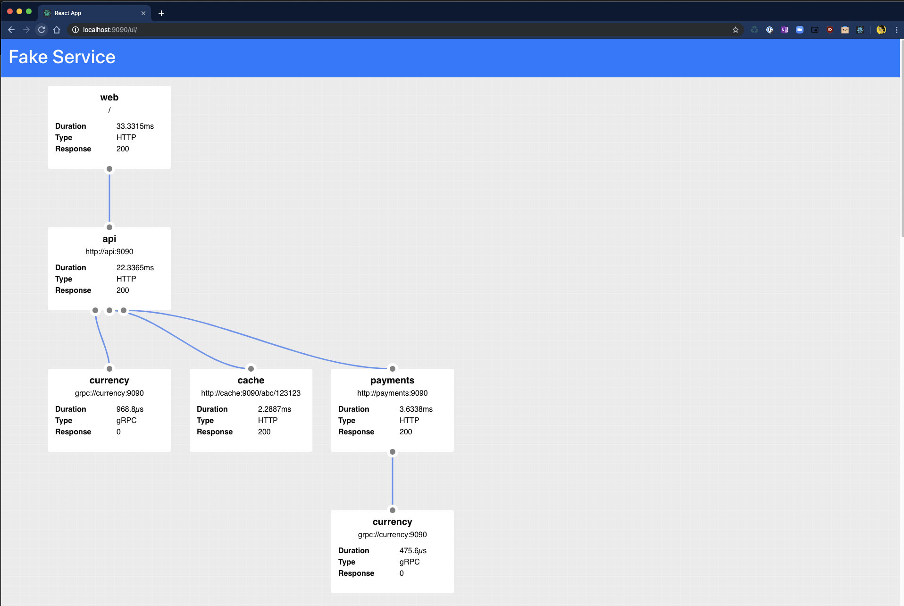
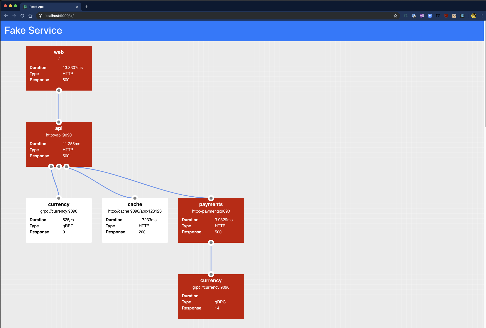

# Fake Service
Fake Service for testing upstream service communications and testing service mesh and other scenarios, can operate as a HTTP or a gRPC service.

[](https://circleci.com/gh/nicholasjackson/fake-service)

Binaries: [https://github.com/nicholasjackson/fake-service/releases/](https://github.com/nicholasjackson/fake-service/releases/)  
Docker Images: [https://hub.docker.com/r/nicholasjackson/fake-service](https://hub.docker.com/r/nicholasjackson/fake-service)  

## Configuration
Configuration values are set using environment variables, for info please see the following list:

```
Configuration values are set using environment variables, for info please see the following list:

Environment variables:
  UPSTREAM_URIS  default: no default
       Comma separated URIs of the upstream services to call
  UPSTREAM_WORKERS  default: '1'
       Number of parallel workers for calling upstreams, defualt is 1 which is sequential operation
  SERVER_TYPE  default: 'http'
       Service type: [http or grpc], default:http. Determines the type of service HTTP or gRPC
  MESSAGE  default: 'Hello World'
       Message to be returned from service, can either be a string or valid JSON
  NAME  default: 'Service'
       Name of the service
  LISTEN_ADDR  default: '0.0.0.0:9090'
       IP address and port to bind service to
  ALLOWED_ORIGINS  default: '*'
       Comma separated list of origins to allow for CORS requests
  HTTP_CLIENT_KEEP_ALIVES  default: 'false'
       Enable HTTP connection keep alives for upstream calls
  HTTP_CLIENT_REQUEST_TIMEOUT  default: '30s'
       Maximum duration for upstream service requests
  HTTP_CLIENT_APPEND_REQUEST  default: 'true'
       When true the path, querystring, and any headers sent to the service will be appended to any upstream calls
  TIMING_50_PERCENTILE  default: '0s'
       Median duration for a request
  TIMING_90_PERCENTILE  default: '0s'
       90 percentile duration for a request, if no value is set, will use value from TIMING_50_PERCENTILE
  TIMING_99_PERCENTILE  default: '0s'
       99 percentile duration for a request, if no value is set, will use value from TIMING_90_PERCENTILE
  TIMING_VARIANCE  default: '0'
       Percentage variance for each request, every request will vary by a random amount to a maximum of a percentage of the total request time
  ERROR_RATE  default: '0'
       Decimal percentage of request where handler will report an error. e.g. 0.1 = 10% of all requests will result in an error
  ERROR_TYPE  default: 'http_error'
       Type of error [http_error, delay]
  ERROR_CODE  default: '500'
       Error code to return on error
  ERROR_DELAY  default: '0s'
       Error delay [1s,100ms]
  RATE_LIMIT  default: '0'
       Rate in req/second after which service will return an error code
  RATE_LIMIT_CODE  default: '503'
       Code to return when service call is rate limited
  LOAD_CPU_CORES  default: '0'
       Number of cores to generate fake CPU load over
  LOAD_CPU_PERCENTAGE  default: '0'
       Percentage of CPU cores to consume as a percentage. I.e: 50, 50% load for LOAD_CPU_CORES
  TRACING_ZIPKIN  default: no default
       Location of Zipkin tracing collector
  TRACING_DATADOG  default: no default
       Location of Datadog tracing collector
  METRICS_DATADOG  default: no default
       Location of Datadog metrics collector
  LOG_FORMAT  default: 'text'
       Log file format. [text|json]
  LOG_LEVEL  default: 'info'
       Log level for output. [info|debug|trace|warn|error]
  LOG_OUTPUT  default: 'stdout'
       Location to write log output, default is stdout, e.g. /var/log/web.log
```

## Tracing
When the `TRACING_ZIPKIN` environment variable is configured to point to a Zipkin compatible collector, Fake Service, will output
traces using the OpenTracing library. These can be viewed Jaeger Tracing or other tools which support OpenTracing.


## Examples

### Docker Compose - examples/docker-compose
This example shows a multi-tier system running in docker compose consisting of 4 services which emit tracing data to Jaeger Tracing.

```
web - type HTTP
  |-- api (upstream calls to payments and cache in parallel) - type gRPC
      |-- payments - type HTTP
      |   |-- currency - type HTTP
      |-- cache - type HTTP
```

To run the example:
```
$ cd examples/docker-compose
$ docker-compose up
Starting docker-compose_currency_1 ... done
Starting docker-compose_cache_1    ... done
Starting docker-compose_api_1      ... done
Starting docker-compose_payments_1 ... done
Starting docker-compose_jaeger_1   ... done
Starting docker-compose_web_1      ... done
Attaching to docker-compose_payments_1, docker-compose_api_1, docker-compose_cache_1, docker-compose_web_1, docker-compose_currency_1, docker-compose_jaeger_1
payments_1  | 2019-08-16T12:15:01.362Z [INFO]  Starting service: name=payments message="Payments response" upstreamURIs=http://currency:9090 upstreamWorkers=1 listenAddress=0.0.0.0:9090 http_client_keep_alives=false zipkin_endpoint=http://jaeger:9411
cache_1     | 2019-08-16T12:15:01.439Z [INFO]  Starting service: name=cache message="Cache response" upstreamURIs= upstreamWorkers=1 listenAddress=0.0.0.0:9090 http_client_keep_alives=false zipkin_endpoint=http://jaeger:9411
```

Then curl the web endpoint:
```
➜ curl -s localhost:9090 | jq
{
  "name": "web",
  "type": "HTTP",
  "duration": "25.4975ms",
  "body": "Hello World",
  "upstream_calls": [
    {
      "name": "api",
      "uri": "grpc://api:9090",
      "type": "gRPC",
      "duration": "20.8857ms",
      "body": "API response",
      "upstream_calls": [
        {
          "name": "payments",
          "uri": "http://payments:9090",
          "type": "HTTP",
          "duration": "8.462ms",
          "body": "Payments response",
          "upstream_calls": [
            {
              "name": "currency",
              "uri": "http://currency:9090/12434/jackson?auth=true",
              "type": "HTTP",
              "duration": "224.9µs",
              "body": "Currency response"
            }
          ]
        },
        {
          "name": "cache",
          "uri": "http://cache:9090",
          "type": "HTTP",
          "duration": "500.5µs",
          "body": "Cache response"
        }
      ]
    }
  ]
}
```

Tracing data can be seen using Jaeger which is running at `http://localhost:16686`.

## Error Injection
Fake Service has the capability to simulate service errors, this feature can be used to test reliability patterns, particularly those which are externailized in a service mesh. The errors which Fake Service can simulate are:

* Service Errors - gRPC and HTTP responses
* Service Delays - Simulate sporadic delays to service execution
* Rate Limiting - Simulate rate limiting of a service

Error Injection can be configured using the following environment variables:

```
  ERROR_RATE  default: '0'
       Decimal percentage of request where handler will report an error. e.g. 0.1 = 10% of all requests will result in an error
  ERROR_TYPE  default: 'http_error'
       Type of error [http_error, delay]
  ERROR_CODE  default: '500'
       Error code to return on error
  ERROR_DELAY  default: '0s'
       Error delay [1s,100ms]
  RATE_LIMIT  default: '0'
       Rate in req/second after which service will return an error code
  RATE_LIMIT_CODE  default: '503'
       Code to return when service call is rate limited
```

All features for Error Injection are available for HTTP and gRPC services.

**NOTE:** gRPC calls do not return a message when an error is returned

### Service Errors
To simulate a HTTP service which returns an Internal Server Error (Status Code 500) error 20% of the time, the following command can be used:

```
$ ERROR_RATE=0.2 ERROR_TYPE=http_error ERROR_CODE=500 fake-service
```

When called Fake Service will return an error 500 for every 2/10 requests:

```
➜ curl -i localhost:9090
HTTP/1.1 500 Internal Server Error
Date: Wed, 25 Sep 2019 09:36:45 GMT
Content-Length: 129
Content-Type: text/plain; charset=utf-8

{
  "name": "web",
  "type": "HTTP",
  "body": "Hello World",
  "code": 500,
  "error": "Service error automatically injected"
}
```

To simulate a gRPC service with the same error response, the following example can be used:

```
$ ERROR_RATE=0.2 ERROR_TYPE=http_error ERROR_CODE=13 SERVER_TYPE=grpc fake-service
```

### Service Delays
Service Delays give more granular control over the time take for a service to respond and can be used in combination with Service Timing. To simulate a execution delay which would result in a client timeout 20% of the time, the following command can be used:

```
$ ERROR_RATE=0.2 ERROR_TYPE=delay ERROR_DELAY=2m  fake-service

➜ curl -i --max-time 0.5 localhost:9090
curl: (28) Operation timed out after 505 milliseconds with 0 bytes received
```

### Rate Limiting
It is possible to configure Fake Service to rate limit calls, rate limiting is applied before Service Errors or Service Delays and can be used in combination with these features. To simulate a service which only allows a rate of 1 request per second, the following example can be used:

```
$ RATE_LIMIT=1 RATE_LIMIT_CODE=429 fake-service
```

When the service is called quickly in succession the second calls with a rate limit error message:

```
➜ curl -i --max-time 0.5 localhost:9090
HTTP/1.1 200 OK
Date: Wed, 25 Sep 2019 09:59:01 GMT
Content-Length: 109
Content-Type: text/plain; charset=utf-8

{
  "name": "Service",
  "type": "HTTP",
  "duration": "21.512µs",
  "body": "Hello World",
  "code": 200
}

➜ curl -i --max-time 0.5 localhost:9090
HTTP/1.1 429 Too Many Requests
Date: Wed, 25 Sep 2019 09:59:02 GMT
Content-Length: 124
Content-Type: text/plain; charset=utf-8

{
  "name": "Service",
  "type": "HTTP",
  "body": "Hello World",
  "code": 429,
  "error": "Service exceeded rate limit"
}
```

### Service Load
Fake Service can simulate load carried out during a service call by configuring the following variables.
```
  LOAD_CPU_CORES  default: '0'
       Number of cores to generate fake CPU load over
  LOAD_CPU_PERCENTAGE  default: '0'
       Percentage of CPU cores to consume as a percentage. I.e: 50, 50% load for LOAD_CPU_CORES
```

For example to simulate a service call consuming 100% of 8 Cores you can run fake service with the following command:

```
LOAD_CPU_CORES=8 LOAD_CPU_PERCENTAGE=100 fake-service
```

## UI
Fake Service also has a handy dandy UI which can be used to graphically represent the data which is returned as JSON when curling.

The API is accessible at the path `/ui` and under the covers just calls the main API endpoint.

**NOTE:** The UI is only available when a service is configured as `HTTP`.

### Example UI


### Example UI with errors

