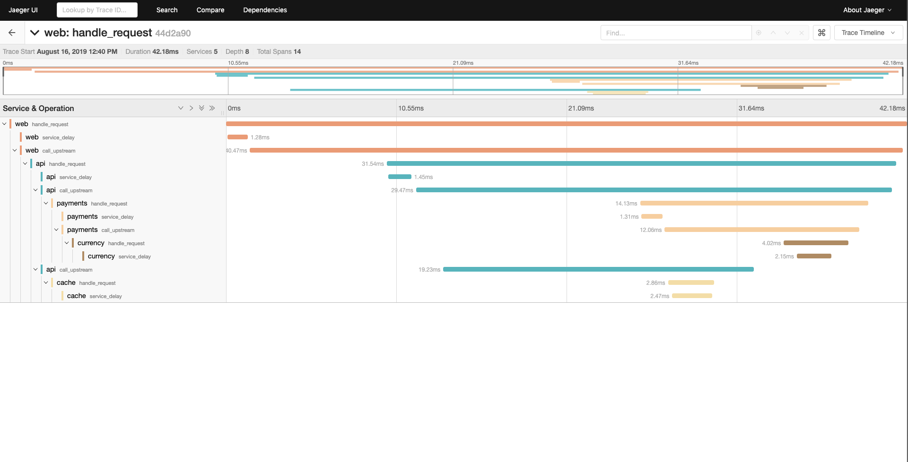

# Fake Service
Fake Service for testing upstream service communications and testing service mesh and other scenarios, can operate as a HTTP or a gRPC service.

[](https://circleci.com/gh/nicholasjackson/fake-service)

## Configuration
Configuration values are set using environment variables, for info please see the following list:

```
Environment variables:
  UPSTREAM_URIS  default: no default
       Comma separated URIs of the upstream services to call, http://somethig.com, or for a grpc upstream grpc://something.com
  UPSTREAM_WORKERS  default: '1'
       Number of parallel workers for calling upstreams, default is 1 which is sequential operation
  MESSAGE  default: 'Hello World'
       Message to be returned from service
  SERVER_TYPE default: 'http'
       Service type: [http or grpc], default:http. Determines the type of service HTTP or gRPC
  NAME  default: 'Service'
       Name of the service
  LISTEN_ADDR  default: '0.0.0.0:9090'
       IP address and port to bind service to
  HTTP_CLIENT_KEEP_ALIVES  default: 'true'
       Enable HTTP connection keep alives for upstream calls
  TIMING_50_PERCENTILE  default: '1ms'
       Median duration for a request
  TIMING_90_PERCENTILE  default: '1ms'
       90 percentile duration for a request
  TIMING_99_PERCENTILE  default: '1ms'
       99 percentile duration for a request
  TIMING_VARIANCE  default: '0'
       Percentage variance for each request, every request will vary by a random amount to a maximum of a percentage of the total request time
  ERROR_RATE  default: '0'
       Percentage of request where handler will report an error
  ERROR_TYPE  default: 'http_error'
       Type of error [http_error, delay]
  ERROR_CODE  default: '500'
       Error code to return on error
  ERROR_DELAY  default: '0s'
       Error delay [1s,100ms]
  TRACING_ZIPKIN  default: no default
       Location of Zipkin tracing collector
```

## Docker Container
```
docker pull nicholasjackson/fake-service:v0.3.2
```

## Tracing
When the `TRACING_ZIPKIN` environment variable is configured to point to a Zipkin compatible collector, Fake Service, will output
traces using the OpenTracing library. These can be viewed Jaeger Tracing or other tools which support OpenTracing.



## Examples

### Docker Compose - examples/docker-compose
This example shows a multi-tier system running in docker compose consisting of 4 services which emit tracing data to Jaeger Tracing.

```
web - type HTTP
  |-- api (upstream calls to payments and cache in parallel) - type gRPC
      |-- payments - type HTTP
      |   |-- currency - type HTTP
      |-- cache - type HTTP
```

To run the example:
```
$ cd examples/docker-compose
$ docker-compose up
Starting docker-compose_currency_1 ... done
Starting docker-compose_cache_1    ... done
Starting docker-compose_api_1      ... done
Starting docker-compose_payments_1 ... done
Starting docker-compose_jaeger_1   ... done
Starting docker-compose_web_1      ... done
Attaching to docker-compose_payments_1, docker-compose_api_1, docker-compose_cache_1, docker-compose_web_1, docker-compose_currency_1, docker-compose_jaeger_1
payments_1  | 2019-08-16T12:15:01.362Z [INFO]  Starting service: name=payments message="Payments response" upstreamURIs=http://currency:9090 upstreamWorkers=1 listenAddress=0.0.0.0:9090 http_client_keep_alives=false zipkin_endpoint=http://jaeger:9411
cache_1     | 2019-08-16T12:15:01.439Z [INFO]  Starting service: name=cache message="Cache response" upstreamURIs= upstreamWorkers=1 listenAddress=0.0.0.0:9090 http_client_keep_alives=false zipkin_endpoint=http://jaeger:9411
```

Then curl the web endpoint:
```
$ curl localhost:9090
# Reponse from: web #
Hello World
## Called upstream uri: grpc://api:9090
  # Reponse from: api #
  API response
  ## Called upstream uri: http://cache:9090
    # Reponse from: cache #
    Cache response

  ## Called upstream uri: http://payments:9090
    # Reponse from: payments #
    Payments response
    ## Called upstream uri: http://currency:9090
      # Reponse from: currency #
      Currency response
```

Tracing data can be seen using Jaeger which is running at `http://localhost:16686`.
